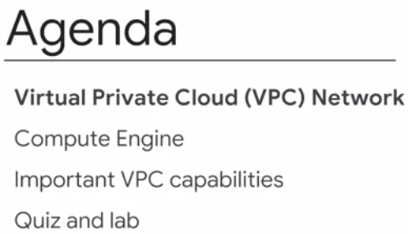
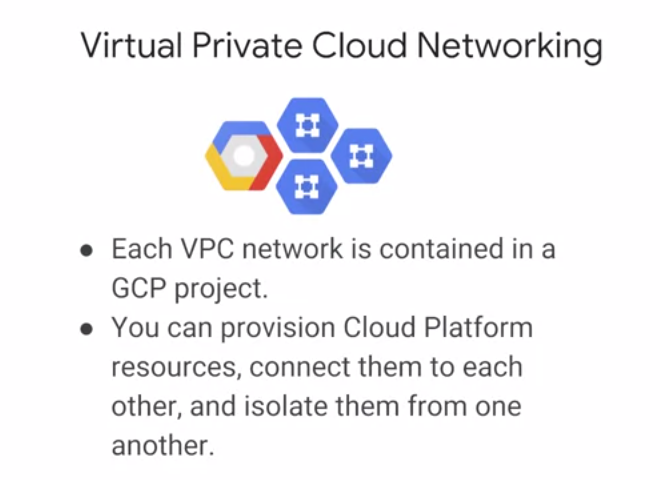
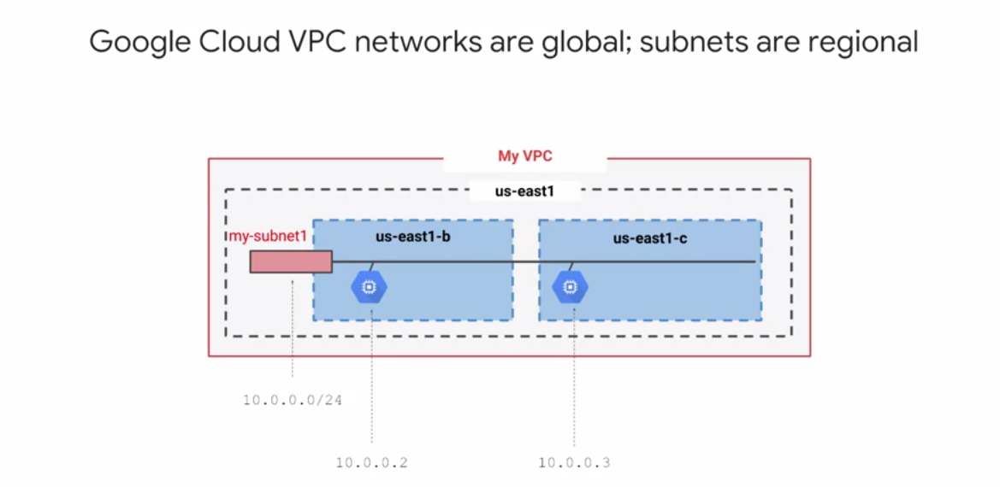

# Compute Engine & virtual Networking.



* Google Compute Engine works with a focus on Google virtual networking.
* Compute Engine lets you run virtual machines on Google's global infrastructure. 
* Virtual machines is that they have the power and generality of a full-fledged operating system in each. 
* You configure a virtual machine much like you build out a physical server by specifying its amounts of CPU power and memory, its amounts and types of storage and its operating system. 
* You can flexibly reconfigure them and a VM running on Google's cloud has unmatched worldwide network connectivity.

## Virtual Private Cloud (VPC)



* VPC networks connect with Google Cloud platform resources to each other and to the internet. 
* VPC can segment your networks, use firewall rules to restrict access to instances, and create static routes to forward traffic to specific destinations.
* The Virtual Private Cloud networks have global scope.
* Subnets can be in any GCP region worldwide and subnets can span the zones that make up a region.
* Resources can be in different zones on the same subnet. 

* It can be Increase the size of a subnet in a custom network by expanding the range of IP addresses allocated to it. 

## Compute Engine

* Compute Engine lets you create and run virtual machines on Google infrastructure. 
* There are no upfront investments and you can run thousands of virtual CPUs on a system that is designed to be fast and to offer consistent performance. 
* You can create a virtual machine instance by using the Google cloud platform console or the gcloud command line tool. 

### Images

* Your VM can run Linux and Windows Server images provided by Google or customized versions of these images. And you can even import images from many of your physical servers. 

### Machine Type

* When you create a VM, pick a machine type which determines how much memory and how many virtual CPUs it has. These types range from very small to very large indeed. And if you can't find a predefined type that meets your needs perfectly, you can make a custom VM.
* Speaking of processing power, If you have workloads like machine learning and data processing that can take advantage of GPUs, many GCP zones have GPUs available for you. 

### Compute Storage

* Just like physical computers need disks, so do VMs. You can choose two kinds of persistent storage, standard or SSD. 
* If your application needs ```high performance scratch space, you can attach a local SSD```.
* Local SSD's content doesn't last past when the VM terminates. That's why the other kinds are called persistent disks. 

### Boot Images & Startup Scripts

* You also choose a boot image. GCP offers lots of versions of Linux and Windows ready to go. And you can import your own images too. 
* If you want VMs to always come up with certain configurations, like installing software packages on first boot. It's very common to pass GCP VM startup scripts that do just that. 
* You can also pass in other kinds of metadata too.
* Once your VMs are running, it's easy to take a durable snapshot of their disks. 
* You can keep these as backups or use them when you need to migrate a VM to another region. 

### Preemptible VM or in AWS we say Didicated Instance

* A preemptible VM is different from an ordinary Compute Engine VM in only one respect. You've given Compute Engine permission to terminate it if its resources are needed elsewhere. 
* You can save a lot of money with preemptible VMs. Although, be sure to make your job able to be stopped and restarted. 

### Compute Engine Capacities

* You can choose the machine proper use of your instances, such as the number of virtual CPUs and the amount of memory, by using a set of predefined machine types or by creating your own custom machine types. 
* The maximum number of virtual CPUs in the VM was 96 and the maximum memory size was in beta at 624 gigabytes. 
* These huge VMs are great for workloads like in-memory databases and CPU intensive analytics. 
* Compute Engine has a feature called Autoscaling that lets you add and take away VMs from your application based on load metrics. 
* The other part of making that work is balancing the incoming traffic across the VMs with Load balancing. 

## Important VPC Capabilities

* Much like physical networks, VPCs have routing tables. These are used to forward traffic from one instance to another instance within the same network.
* Even across sub-networks and even between GCP zones without requiring an external IP address. 
* VPCs routing tables are built in, you don't have to provision or manage a router. 

### Firewall Rules on VPC

* Another thing you don't have to provision or manage for GCP, a firewall instance. VPCs give you a global distributed firewall. You can control to restrict access to instances, both incoming and outgoing traffic. 
* You can define firewall rules in terms of metadata tags on Compute Engine instances, which is really convenient. 
* For example, you can tag all your web servers with say, "web," and write a firewall rule saying that traffic on ports 80 or 443 is allowed into all VMs with the "web" tag, no matter what their IP address happens to be.

### Shared VPC

*  VPC belongs to GCP projects, But if your company has several GCP projects and the VPCs need to talk to each other that's totally doable and manageable. 
*   If you simply want to establish a peering relationship between two VPCs so that they can exchange traffic, that's what VPC Peering does. 
*   Using full power of IAM to control who and what in one project can interact with a VPC in another, that's what Shared VPC is for. 

### Cloud Load Balancing

* With Cloud Load Balancing, a single anycast IP frontends all your backend instances in regions around the world. 
* It provides cross-region load balancing, including automatic multi-region failover, which gently moves traffic in fractions if backends become unhealthy.
* Cloud Load Balancing reacts quickly to changes in users, traffic, backend health, network conditions, and other related conditions. 

### Load Balancing Types

* If you need cross regional load balancing for a web application, use HTTPS load balancing. 
* For Secure Sockets Layer traffic that is not HTTP, use the global SSL proxy load balancer. 
* If it's other TCP traffic that does not use Secure Sockets Layer, use the global TCP proxy load balancer. Those two proxy services only work for specific port numbers, and they only work for TCP. 
* If you want to load balance UDP traffic or traffic on any port number, you can still load balance across a GCP region with the regional load balancer. 
* if you want to load balance traffic inside your project between the presentation layer and the business logic layer of your application? For that, use the internal load balancer. It accepts traffic on a GCP internal IP address and load balances it across Compute Engine VMs. 

### Cloud DNS

* One of the most famous Google services that people don't pay for is 8.8.8.8, which provides a public domain name service to the world. 
* It's a managed DNS service running on the same infrastructure as Google. 
* It has low latency and high availability and it's a cost-effective way to make your applications and services available to your users. 
* The DNS information you publish is served from redundant locations around the world. 
* Cloud DNS is also programmable. You can publish and manage millions of DNS zones and records using the GCP console, the command line interface or the API. 

### Cloud CDN

* Google has a global system of edge caches. You can use this system to accelerate content delivery in your application using Google Cloud CDN. 
* Your customers will experience lower network latency.
* The origins of your content will experience reduced load and you can save money too. 
* Once you've set up HTTPS load balancing, simply enable Cloud CDN with a single checkbox. 

### Cloud Router & VPN Interconnectivity

* Virtual Private Network connection over the internet using the IPSEC protocol. To make that dynamic, they use a GCP feature called Cloud Router.
* Cloud Router lets your other networks and your Google VPC exchange route information over the VPN using the Border Gateway Protocol. 
* For instance, if you add a new subnet to your Google VPC, your on-premises network will automatically get routes to it. 

### Direct Peering

* If you don't want to use the internet, either because of security concerns or because they need more reliable bandwidth. They can consider peering with Google using Direct Peering. 
* Peering means putting a router in the same public data center as a Google point of presence and exchanging traffic. Google has more than 100 points of presence around the world. 
* One downside of peering though is that it isn't covered by a Google service level agreement. 

### Didicated Interconnect

* Customers who want the highest uptimes for their interconnection with Google should use Dedicated Interconnect, in which customers get one or more direct private connections to Google. 
* If these connections have topologies that meet Google's specifications, they can be covered by up to a 99.99 percent SLA. 
* These connections can be backed up by a VPN for even greater reliability.


