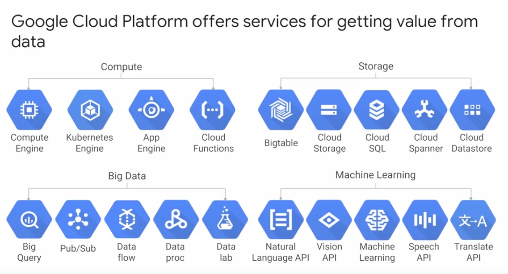

# GCP (Google Cloud Platform)

GCP offers 4 main type of services.
* Compute
* Storage   
* Big data
* Machine Learning

## Cloud computing
It is a way of using IT to use the 5 different services.
* On-demand Self service
* Broad network access
* Resource pooling
* Rapid elasticity
* Measured service

## History and need to introduce cloud
* Initially we use seperate resources at our home and office adding such infrastructure cost more and seperately expensive.
* Then  we came to virtualized where we buy needed resources instances according to our usage since if the resource pool gets overloaded then we need to add resources seperately to continue fuctioning.
* Now Google cloud does everyday automated it is now container based architecture.
* Buy your own hardware for your requirements, physical configuration totally user configured managed and maintained.
* Virtualized User Configured provider managed and maintained
* Serverless Fully automated, its container based architecture.
* Every company is a data company and calculating on the huge data requires hige computation power and cloud computing is a solution for that.
* Cloud computing provides you to scale your resources up and down.
### Key Products
* Compute Engine IAAS
* Kubernates Engine Hybrid
* App Engine PAAS
* Cloud Functions Serverless Logics
* Managed Servers Automated Elastic Resources.
* SAAS Search Gmail Youtube Comes in SAAS.

## GCP Zones
* When we build an application of GCP we select a zone on which the application will run, the GCP uses the nearest possible zone to reduce the latency of the instances.
* Zones are of 4 types
    *   Country
    * Multi-Region
    * Region
    * Specific Area | Locality | State
*   To create a fault tolenrence application we can use different zones.
* Googles all data centers use totally 100% green energy.

## GCP Pricing
* Billing in subhour increments
    *   For Virtual Machines containers in the cloud data processing and other services too.
* Discounted for Sustained Use
    * Automatically applied to virtual machines use over 25% of month.
* Custom VM instance Types
    *   Pay only for the resources you need for your application.

## Open API
* Cloud Bigtable uses the interface of the open source database Apache HBase which gives customers for benifit of code portability.
* Cloud DataProc offers the open source big data enviorment hadoop as managed service.
* Kubernates gives customers the ability to mix and match micro services running accross different clouds
* Google StackDriver lets customers monitor workloads accross multiple cloud provider.

## GCP Services
* Compute
* Storage
* Big Data
* Machine Learning

## Multilayered Security Approach
*   Both the server boards and networking boards are designed by google.
* Google also designed its own custom security chips called titan which is currently deployed to both servers and peripherals.
* Google Infrastructure provides cryptograpic privacy and integrity for remote procedures and access to thier network.

## Budgets and Bills
*   We can setup a billing account specifically for a project or such.
*   Billing alerts can be set for notifications on Dashboard regarding the remaining budget of your project.

* Billing export for more detailed billing information  in places where its easy to retrieve for more detailed ananlysis such as a big query dataset or a cloud storage bucket.

*   Reports is a visual tool that allows you to monitor your expenditure.

*   GCP Quotas are designed to prevent the over consumption of resources whheather there is an error or in malicious attacks.
*   There are two types of quotas Rate quota and allocation quota both are applied at the level of a GCP project.

* **Rate quotas** reset after a specific time.
    * For example, by default, the Kubernetes Engine service sets a quota of a 1000 calls to its API from each GCP project every 100 seconds. After that 100 seconds, the limit is reset. 
* **Allocation quotas**, on the other hand, govern the number of resources you can have in your projects. 
    * For example, by default, each GCP project has a quota allowing it no more than five Virtual Private Cloud networks. 
* Although projects all start with the same quotas, you can change some of them by requesting an increase from Google Cloud support.

# Module 2 IAM and IM
* When you run your workloads in GCP, you use projects to organize them. You use Google Cloud Identity, and Access Management, also called IM, or IAM to control who can do what. And you use your choice of several interfaces to connect.

*   In this module, you'll use these basics to get started. Projects are the main way you organize the resources you use in GCP. Use them to group together related resources, usually because they have a common business objective. 
* The principle of least privilege is very important in managing any kind of compute infrastructure, whether it's in the Cloud or on-premises. This principle says that each user should have only those privileges needed to do their jobs. In a least-privilege environment, people are protected from an entire class of errors. 
* GCP customers use IM to implement least privilege, and it makes everybody happier. 
* There are four ways to interact with GCP's management layer: through the web-based console, through the SDK and its command-line tools, through the APIs, and through a mobile app. In this class, you'll mostly use the console and the command-line tools. 
* When you build an application on your on-premises infrastructure, you're responsible for the entire stack security. From the physical security of the hardware, and the premises in which they're housed, through the encryption of the data on disk, the integrity of your network, all the way up to securing the content stored in those applications. 
* When you move an application to Google Cloud Platform, Google handles many of the lower layers of security. Because of its scale, Google can deliver a higher level of security at these layers than most of its customers could afford to do on their own. 
* The upper layers of the security stack remain the customers' responsibility. Google provides tools such as IAM to help customers implement the policies they choose at these layers.

## GCP Resource Hierarchy
* 

* You may find it easiest to understand the GCP resource hierarchy from the bottom up. All the resources you use, whether they're virtual machines, cloud storage buckets, tables and big query or anything else in GCP are organized into projects. 
* Optionally, these projects may be organized into folders. Folders can contain other folders. All the folders and projects used by your organization can be brought together under an organization node.
*  Projects, folders and organization nodes are all places where the policies can be defined. 
* Some GCP resources let you put policies on individual resources too. 
* All Google Cloud platform resources belong to a project. Projects are the basis for enabling and using GCP services like managing APIs, enabling billing and adding and removing collaborators and enabling other Google services. 
* Each project is a separate compartment and each resource belongs to exactly one. Projects can have different owners and users - they're built separately and they're managed separately. 

## Project Attributes
 

 
* Each GCP project has a name and a project ID that you assign. 
* The project ID is a permanent, unchangeable identifier and it has to be unique across GCP. 
* You use project IDs in several contexts to tell GCP which project you want to work with. On the other hand, project names are for your convenience and you can assign them. 
* GCP also assigns each of your projects a unique project number and you'll see a display to you in various contexts. In general, project IDs are made to be human readable strings and you'll use them frequently to refer to projects. 
* You can organize projects into folders, although you don't have to. They're a tool at your disposal to make your life easier. 
* For example, you can use folders to represent different departments, teams, applications or environments in your organization. 

* Folders let teams have the ability to delegate administrative rights, so they can work independently. 
* The resources in a folder inherit IAM policies from the folder. So, if project three and four are administered by the same team by design, you can put IAM policies into folder B instead. Doing it the other way, putting duplicate copies of those policies on project three and project four would be tedious and error prone. 

* One word of caution: to use folders, you need an organization node at the top of the hierarchy. So what's that? Let's talk about it now. You probably want to organize all the projects in your company into a single structure. 
* Most companies want the ability to have centralized visibility on how resources are being used and to apply policy centrally. That's what the organization node is for. It's the top of the hierarchy. 
* There are some special roles associated with it. For example, you can designate an organization policy administrator so that only people with privilege can change policies. 
* You can also assign a project creator role, which is a great way to control who can spend money. So how do you get an organization node? In part the answer depends on whether your company is also a G Suite customer. 
* If you have a G Suite domain, GCP projects will automatically belong to your organization node. Otherwise, you can use Google Cloud Identity to create one. 

* When you get a new organization node, it lets anyone in the domain create projects and billing accounts just as they could before. 
* Once you have an organization node, you can create folders underneath it and put it in projects. Here's an example of how you might organize your resources. There are three projects each of which uses resources from several GCP services. 
* In this example, we haven't used any folders, although we could always move projects into folders. Resources inherit the policies of their parent resource. For instance, if you set a policy at the organization level, it is automatically inherited by all its children projects. And this inheritance is transitive, which means that all the resources in those projects inherit the policy too. 
* There's one important rule to keep in mind. The policies implemented at a higher level in this hierarchy can't take away access that's granted at a lower level. For example, suppose that a policy applied on the bookshelf project gives user Pat the right to modify a cloud storage bucket, but a policy at the organization level says that Pat can only view cloud storage buckets not change them. 
* The more generous policy is the one that takes effect. Keep this in mind as you design your policies.

